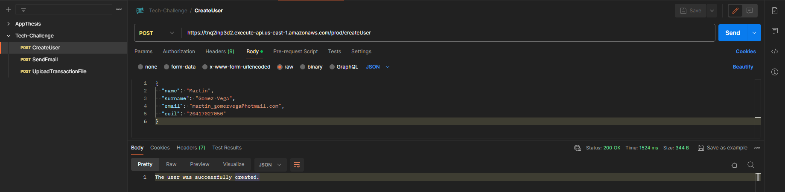
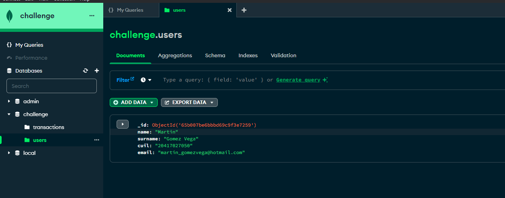
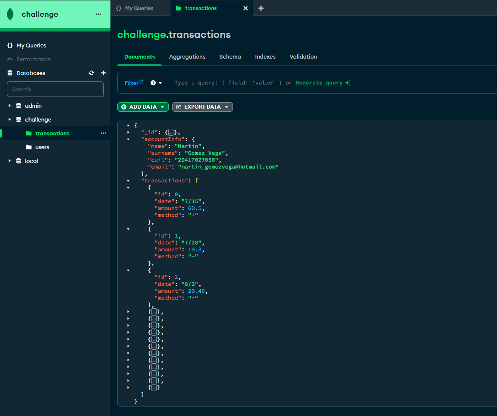
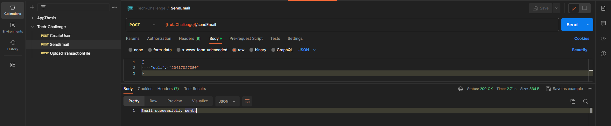
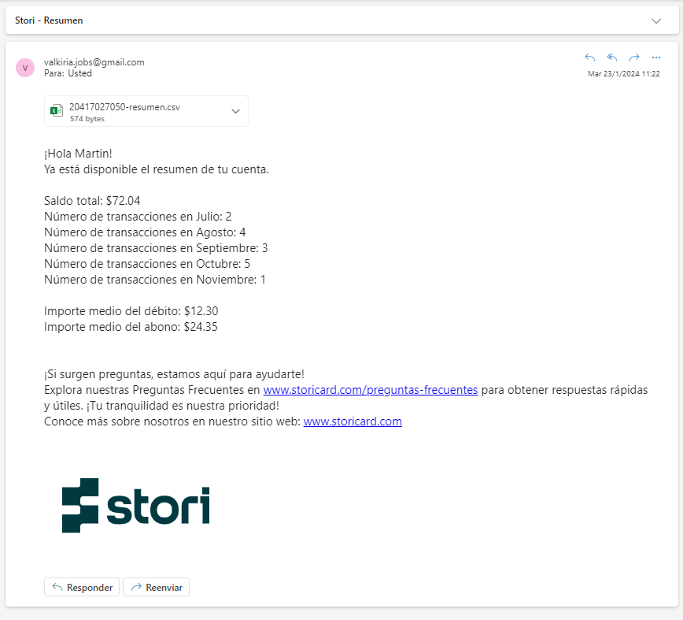

# Tech_Challenge

## Descripción del proyecto

Este proyecto consiste en una aplicación que procesa transacciones financieras y envía un resumen por correo electrónico a los usuarios. La aplicación utiliza AWS con API Gateway, Lambda y S3 para gestionar la infraestructura y ejecutar el código de procesamiento.

## Descripción de la interfaz del código

### Estructura del proyecto

Este proyecto sigue una estructura modular que se adapta a las limitaciones de recursos en la cuenta gratuita de AWS.
La estructura del repositorio es la siguiente:

#### Raíz

- **`main.go`**: Punto de entrada principal de la aplicación.
- **`README.md`**: Documentación principal del proyecto.
- **`.gitignore`**: Archivo especificando qué archivos y carpetas deben ignorarse en Git.

#### Carpeta `secretmanager/`

- **`sm.go`**: Recupera información confidencial almacenada en AWS Secrets Manager utilizando el nombre del secreto proporcionado

#### Carpeta `routers/`

- **`uploadTransactionFile.go`**: Maneja la carga de archivos CSV con transacciones financieras al sistema.
- **`sendEmail.go`**: Enviar el correo electrónico con la información resumida de los costes al usuario.
- **`createUser.go`**: Crea al usuario en la coleccion users en MongoDB.

#### Carpeta `models/`

- **`user.go`**: Definición del modelo de datos para usuarios.
- **`sm.go`**: Definición del modelo de datos para el uso del secret manager.
- **`types.go`**: Definición del modelo de dato para obtener el valor de los parametros.
- **`responseAPI.go`**: Definición del modelo de datos para la respuesta de la API Gateway.
- **`transaction.go`**: Definición del modelo de datos para transacciones.

#### Carpeta `handlers/`

- **`handlers.go`**: Manejador para las solicitudes.

#### Carpeta `commons/`

- **`calculateAverageAmounts.go`**: Calcula los importes medios de débito y crédito por mes.
- **`calculateTotalBalance.go`**: Calcula el saldo total de cargos y abonos.
- **`calculateTotalTransactionsByMonth.go`**: Calcula el número total de transacciones de cada mes.
- **`getCuilFromFilename.go`**: Obtiene el cuil del nombre del archivo sin la extensión .csv
- **`getMonthInSpanish.go`**: Convierte el número del mes en su nombre en inglés.
- **`getTransactionFile.go`**: Obtiene el archivo del bucket s3 con el cuil.

#### Carpeta `bd/`

- **`checkUserExists.go`**: Chequea si el usuario existe en la coleccion users.
- **`conectionDB.go`**: Conexion a la base de datos.
- **`getAccountByCuil.go`**: Obtiene la cuenta completa por cuil.
- **`getUser.go`**: Obtiene el usuario de la coleccion users con el cuil.
- **`insertUser.go`**: Inserta al usuario en la coleccion users.
- **`storeInMongoDB/`**: Almacena un documento de Cuenta en MongoDB.

#### Carpeta `awsgo/`

- **`awsgo.go`**: Inicializa la configuración de AWS para la aplicación.

### Escenario con Cuenta Empresarial

En un entorno empresarial con mayores recursos, expandiría la estructura para aprovechar servicios adicionales de AWS. Esto incluiría la implementación de una API Gateway privada que permita la creación de múltiples recursos, junto con la habilitación de diversas Lambdas para ejecutar el proceso de manera eficiente. La primera Lambda se dedicaría a la creación de usuarios, mientras que otra se encargaría de cargar archivos en un bucket S3 privado. Ambas Lambdas estarían vinculadas a la API Gateway.

Adicionalmente, integraría una tercera Lambda que se activaría mediante eventos en el bucket S3, ejecutándose automáticamente al detectar la carga de un archivo. Esta Lambda reuniría información del cliente, identificando el CUIL a partir del nombre del archivo, y posteriormente enviaría un correo electrónico al usuario con un resumen detallado de la cuenta.

En el proceso de gestión y provisión de recursos en la nube, optaría por utilizar Terraform y Terragrunt. Estas herramientas, ampliamente reconocidas en entornos de desarrollo y operaciones, facilitarían la automatización de la creación y gestión de infraestructuras en AWS. Con su ayuda, establecería la API Gateway, las Lambdas, las tablas en DynamoDB y el bucket en S3, garantizando que todos los servicios cuenten con los permisos necesarios para una operación segura y eficiente.

Al utilizar la cuenta gratuita de AWS, me he topado con algunos desafíos debido a los límites establecidos. Estos límites más bajos han generado problemas notables al intentar desarrollar proyectos más avanzados. En particular, me he enfrentado a restricciones en el almacenamiento y las solicitudes, lo que dificulta la escalabilidad de las aplicaciones.
Servicios clave como Amazon S3 y Lambda han experimentado interrupciones debido a limitaciones en la cantidad de operaciones permitidas. Además, la conectividad limitada a servicios externos y el acceso restringido a la red han complicado la interacción con recursos fuera del entorno de AWS. Para superar estos desafíos, he tenido que estar atento a los límites y considerar la posibilidad de migrar a una cuenta de pago para un desarrollo más fluido y sin restricciones en la plataforma de AWS.

## Instrucciones de ejecución

### Paso 1: Crear el usuario

- Para ejecutar el código, sigue estos pasos:

1. Accede a la API Gateway mediante Postman con el siguiente enlace con el método `POST`: https://tnq2inp3d2.execute-api.us-east-1.amazonaws.com/prod/createUser
2. En el cuerpo de la solicitud, proporciona un JSON con la información del usuario:

```json
{
  "name": "Martin",
  "surname": "Gomez Vega",
  "email": "martin_gomezvega@hotmail.com",
  "cuil": "20417027050"
}
```

Este endpoint crea un usuario en la colección de MongoDB llamada "users". El CUIL se utiliza como identificador y se vincula al archivo que se cargará más adelante.





### Paso 2: Cargar archivo de transacciones

Para cargar el archivo de transacciones, sigue estos pasos:

1. Accede a la API Gateway mediante Postman utilizando el siguiente enlace con el método `POST`: https://tnq2inp3d2.execute-api.us-east-1.amazonaws.com/prod/uploadTransactionFile

2. Selecciona la opción de `form-data` en el cuerpo de la solicitud para permitir la carga de archivos.

3. Adjunta el archivo CSV que contiene las transacciones. Asegúrate de que el archivo tenga el formato adecuado, con columnas como "Id", "Date", y "Transaction" (por ejemplo).

4. Envía la solicitud.

Este proceso cargará el archivo de transacciones en el sistema. Internamente, el sistema almacenará el archivo en el bucket S3 llamado "challenge" y registrará los detalles de las transacciones en la colección "transactions".
Una vez completado este paso, estarás listo para proceder al Paso 3 y obtener el resumen de transacciones.

<!-- Agregar imagen del archivo subido correctamente -->




### Paso 3: Envío del resumen de cuenta por correo electrónico

Para recibir el resumen de cuenta por correo electrónico, sigue estos pasos:

1. Accede a la API Gateway mediante Postman utilizando el siguiente enlace con el método `POST`: https://tnq2inp3d2.execute-api.us-east-1.amazonaws.com/prod/sendEmail

2. En el cuerpo de la solicitud, proporciona un JSON con tu número de CUIL:

```json
{
  "cuil": "20417027050"
}
```

3. Envia la solicitud

Este proceso obtendrá la información del usuario asociada al cuil proporcionado. Luego, calculará el saldo total, el total de transacciones agrupadas por mes, el importe medio de débito y crédito. A continuación, armará un correo electrónico detallado y lo enviará desde la dirección de correo electrónico valkiria.jobs@gmail.com.
El correo electrónico contendrá información adicional para mejorar la visualización, incluyendo la imagen de Stori y el archivo que cargaste en el Paso 2. Utilice mi correo personal que cree para mi tesis de Ingeniería informática.





¡Con estos pasos, habrás completado el proceso! Si tienes alguna pregunta o encuentras algún problema, no dudes en contactarme.
